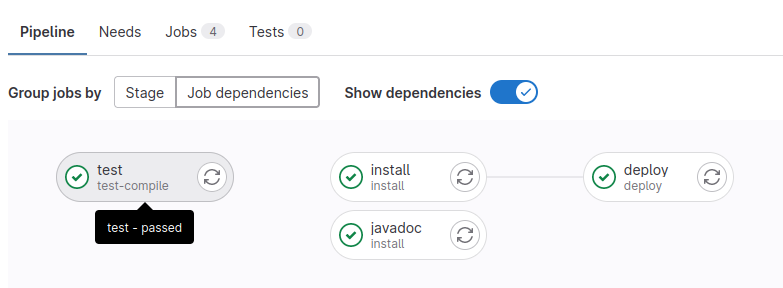
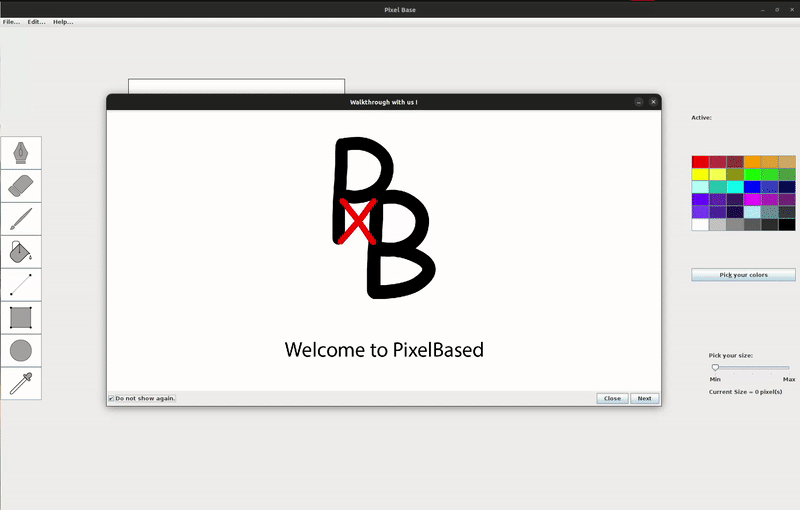
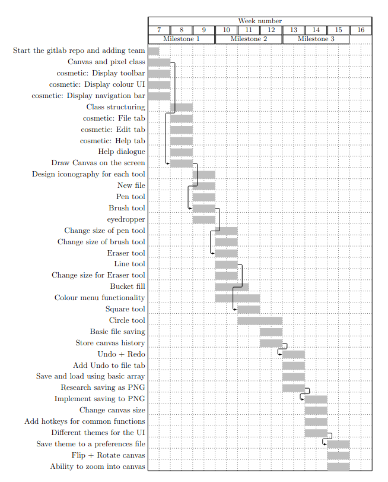

# scc210-2223-grp-26

## Integrate with your tools

- Java 
- Maven 

## Collaborate with your team

- Hoang Ky Trinh (Kyle)
- Alden Ong
- Adil Wadeer
- George Sanderson
- Dexter Latcham
- Jake Edwardson

## Pipeline CI/CD
- Pipeline CI/CD is generated with 3 stages 

## How to deploy
Test : 

    mvn clean test

Deploy : 

    mvn clean deploy

Javadoc : 

    mvn javadoc:javadoc

## Result 

This is how you compile it into jar file yourself.

## Usage
Java 8 or later to run PixelBase
You can run the application from command line:

    cd ./target
    java -jar pixelbased-1.1-Released.jar

## Name
- PixelBased 

## Description
- This project was created with the intention of having a free application that allowed users to draw and perform some other basic tasks.
- A lightweight and OS-agnostic image editor would be genuinely useful for low-end machines. 

## Visuals

## Roadmap

## Authors and acknowledgment
- Hoang Ky Trinh (Kyle)
- Alden Ong
- Adil Wadeer
- George Sanderson
- Dexter Latcham
- Jake Edwardson

## Project status
If you have run out of energy or time for your project, put a note at the top of the README saying that development has slowed down or stopped completely. Someone may choose to fork your project or volunteer to step in as a maintainer or owner, allowing your project to keep going. You can also make an explicit request for maintainers.
